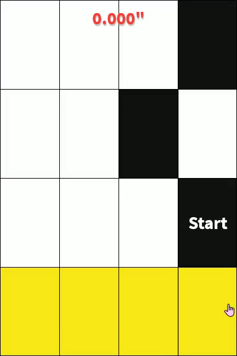
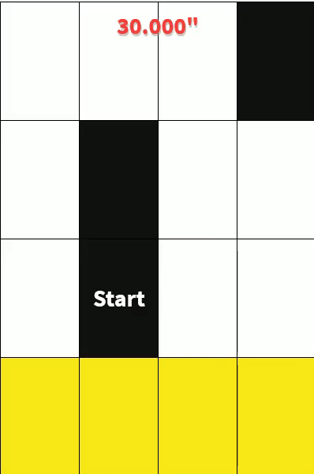

# pianoTilesBot
Image Recognition to play the Piano Tiles game!

My bot creates a Queue of all black squares on the screen by using sampling points.

If a sampling point has pixel value that is equivalent to black then it is added to the queue.

Then, a clicking-task is issued. Wherein, I pop elements off my Queue and click the pixel that was detected to be black.

**Real-Time Examples** (this website seems to play the timer twice as fast, I assure you this is in real-time)

**classic mode:**

**Zen Mode:**

website used: http://tanksw.com/piano-tiles/  (I am not affiliated with this site and am not responsible for anything that happens :) )
